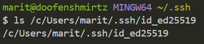
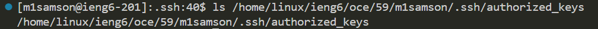
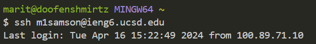

# Part One
---
```
class Handler implements URLHandler {
    // Where the chat log, the current user, and message will be saved
    String chatLog = "";
    String user = "";
    String message = "";
    public String handleRequest(URI url) {
        if (url.getPath().equals("/")) {
            if (chatLog.equals("")){
                return "No chat found";
            }
        }
        else if (url.getPath().equals("/add-message")) {
            String[] parameters = url.getQuery().split("=");
            if (parameters[0].equals("s")){
                String[] firstHalfParam = parameters[1].split("&");
                message = firstHalfParam[0];
                if (firstHalfParam[1].equals("user")){
                    if (parameters.length == 3) user = parameters[2];
                    chatLog += String.format("%s: %s", user, message) + "\n";
                    System.out.println(chatLog);
                    return chatLog;
                }
            }
        }
        return "404 Not Found!";
    }
}
```

# Part Two
---
1. 
2.  
3.  

# Part Three
---
All of week two and three are completely new content to me, but to be specific, I learned more about the 'ssh' command and connecting to remote servers. The `ssh` command allows for the programmer to operate from a different location on another server.
