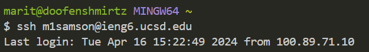

# Part One
---

# Part Two
---
1. a
2.  a
3.  

# Part Three
---
All of week two and three are completely new content to me, but to be specific, I learned more about the 'ssh' command and connecting to remote servers. The `ssh` command allows for the programmer to operate from a different location on another server.
