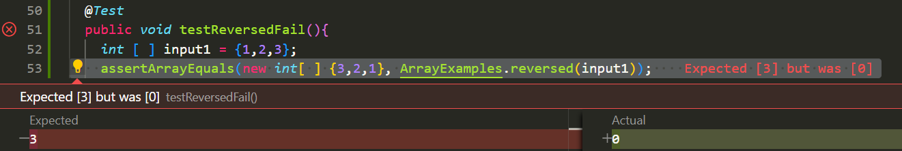
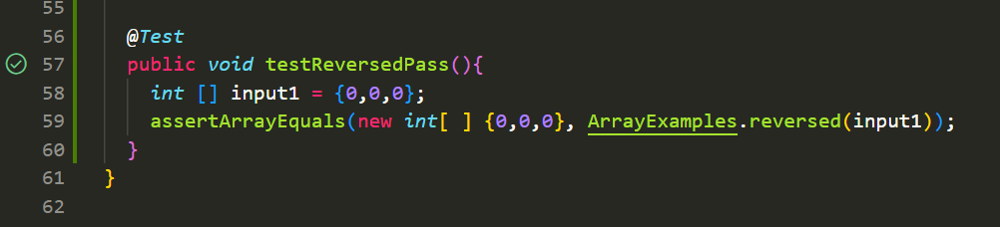

# Lab Report 3
# Bugs and Commands
---
## Part 1 : Bugs
`static int[ ] reversed (int [ ] arr)`
1. Failure-inducing input for the buggy program
```
@Test
public void testReversedFail(){
  int [ ] input1 = {1,2,3};
  assertArrayEquals(new int[ ] {3,2,1}, ArrayExamples.reversed(input1));
}
```
2.  Non-failing input
```
@Test
public void testReversedPass(){
  int [] input1 = {0,0,0}
  assertArrayEquals(new int[ ] {3,2,1}, ArrayExamples.reversed(input1));
}
```
3.   Systems
    Fail
    
    Pass
    
5.   The bug
```
static int [] reversed(int[] arr) {
  int [ ] newArray = new int[arr.length];
  for(int i=0; i<arr.length; i++){
    arr[i] = newArray(arr.length - i - 1);
  }
  return arr;
}
```

```
static int[] reversed (int[] arr){
  int [] newArray = new int[arr.length];
  for(int i=0; i<arr.length; i++){
    newArray[i] = arr(arr.length - i - 1);
  }
  return newArray;
}
```
5. **Why does this fix the issue?**
The bug is found on lines 4 and 5 of the code blocks. The method was supposed to copy elements from `arr` to `newArray`, but instead the elements from `newArray` is copied to `arr`.  `newArray` is instantiated as an array full of zeroes, and so the array returned is `arr` that has been changed to be an array full of zeroes. The fixed code is fixed because it properly copies the elements from `arr` to `newArray` in the reversed order. 
---
## Part 2 : Researching Commands
I chose to research the `grep` command. 

1. The `grep -n` command shows the matched lines and the line numbers that a given pattern appears on.

> Example 1:

```
marit@doofenshmirtz MINGW64 ~/docsearch (main)
$ grep -n "binge drinking" technical/government/alcohol_problems/*.txt
technical/government/alcohol_problems/Session2-PDF.txt:72:identifying patients with binge drinking, we can define binge
technical/government/alcohol_problems/Session4-PDF.txt:812:strategies that are associated with college-based binge drinking is

```

> Example 2:

```
marit@doofenshmirtz MINGW64 ~/docsearch (main)
$ grep -n "transgene integration" technical/biomed/*.txt
technical/biomed/1471-213X-1-10.txt:36:        the number and genomic location of transgene integration
technical/biomed/1471-2407-2-33.txt:430:        transgene integration.
technical/biomed/1472-6750-1-12.txt:24:        The problem of random transgene integration can be

```
In the examples shown above, the outputs show where the pattern appears in the specified files and the line location. The `grep -n` command could be used for looking for specific words and phrases in a file.

2. The `grep -i` command shows lines with matching criteria while ignoring upper and lowercasing.

> Example 1:

```
marit@doofenshmirtz MINGW64 ~/docsearch (main)
$ grep -i "terrorist attack" technical/911report/*.txt
technical/911report/chapter-1.txt:The Pentagon Teleconferences. Inside the National Military Command Center, the deputy director for operations immediately thought the second strike was a terrorist attack. The job of the NMCC in such an emergency is to gather the relevant parties and establish the chain of command between the National Command Authority-the president and the secretary of defense- and those who need to carry out their orders.
technical/911report/chapter-10.txt:                investigation of the 9/11 terrorist attacks.
technical/911report/chapter-12.txt:                terrorist attacks in Riyadh has apparently reduced the funds available to al
technical/911report/chapter-12.txt:            PROTECT AGAINST AND PREPARE FOR TERRORIST ATTACKS
...
```

> Example 2:

```
marit@doofenshmirtz MINGW64 ~/docsearch (main)
$ grep -i "counterterrorism" technical/911report/*.txt
technical/911report/chapter-1.txt:    At the White House, the video teleconference was conducted from the Situation Room by Richard Clarke, a special assistant to the president long involved in counterterrorism. Logs indicate that it began at 9:25 and included the CIA; the FBI; the departments of State, Justice, and Defense; the FAA; and the White House shelter. The FAA and CIA joined at 9:40. The first topic addressed in the White House video teleconference-at about 9:40-was the physical security of the President, the White House, and federal agencies. Immediately thereafter it was reported that a plane had hit the Pentagon. We found no evidence that video teleconference participants had any prior information that American 77 had been hijacked and was heading directly toward Washington. Indeed, it is not clear to us that the video teleconference was fully under way before 9:37, when the Pentagon was struck.
technical/911report/chapter-10.txt:            In response to a request about the counterterrorism benefits of the 9/11 detainee
technical/911report/chapter-11.txt:                months before 9/11:"It would be a mistake to redefine counterterrorism as a task of
technical/911report/chapter-11.txt:                alerts, when the nation had relaxed, Clarke held a meeting of his Counterterrorism
...
```
In these examples of the command, the computer takes the input and finds matching patterns regardless of it matching the upper or lower case of the pattern in the files. In the terminal, it prints a short portion of the sentence where the pattern is found. This `grep -i` command would be useful in finding words or phrases that you aren't sure if it is capitalized. (Note: I have shortened the output due to the large amount in the result)

3. The `grep -c` command prints each file within the given file and the amount of times the given pattern shows up in the file.

> Example 1:

```
marit@doofenshmirtz MINGW64 ~/docsearch (main)
$ grep -c "binge drinking" technical/government/alcohol_problems/*.txt
technical/government/alcohol_problems/DraftRecom-PDF.txt:0
technical/government/alcohol_problems/Session2-PDF.txt:1
technical/government/alcohol_problems/Session3-PDF.txt:0
technical/government/alcohol_problems/Session4-PDF.txt:1

```

> Example 2:

```
marit@doofenshmirtz MINGW64 ~/docsearch (main)
$ grep -c "transgene integration" technical/biomed/*.txt
technical/biomed/1468-6708-3-1.txt:0
technical/biomed/1468-6708-3-10.txt:0
technical/biomed/1468-6708-3-3.txt:0
technical/biomed/1468-6708-3-4.txt:0
technical/biomed/1468-6708-3-7.txt:0
technical/biomed/1471-2091-2-10.txt:0
technical/biomed/1471-2091-2-11.txt:0
technical/biomed/1471-2091-2-12.txt:0
technical/biomed/1471-2091-2-13.txt:0
technical/biomed/1471-2091-2-16.txt:0
...
```
In these two examples, the command takes the pattern inputted and finds how many times it appears in each file under the file inputted. The `grep -c` command could be useful in finding information on a topic counting how many times a topic comes up in a group of files.
(Note: I have shortened the output due to the large amount in the result)

4. The `grep -l` command 
> Example 1:

```
marit@doofenshmirtz MINGW64 ~/docsearch (main)
$ grep -l "binge drinking" technical/government/alcohol_problems/*.txt
technical/government/alcohol_problems/Session2-PDF.txt
technical/government/alcohol_problems/Session4-PDF.txt
```
> Example 2:

```
marit@doofenshmirtz MINGW64 ~/docsearch (main)
$ grep -l "transgene integration" technical/biomed/*.txt
technical/biomed/1471-213X-1-10.txt
technical/biomed/1471-2407-2-33.txt
technical/biomed/1472-6750-1-12.txt
```

In these examples, the command takes the pattern inputted and prints out the files that the pattern appears in. The `grep -l` command could be used when wanting to strategically find files with the applicable word/phrase.

References:
- [GeeksForGeeks](https://www.geeksforgeeks.org/grep-command-in-unixlinux/)
